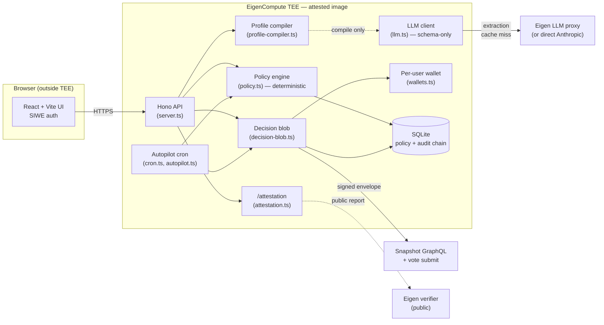

# Governance Agent — Overview

A verifiable, policy-bound governance delegate built on EigenCompute. Token
holders write their values in plain language; an LLM compiles them into a
deterministic rule set; the rules — not the model — decide each vote; and a
TEE-bound wallet signs the resulting decision blob inside an attested image.
This document is the entry point for an Eigen reviewer. The on-stage
walk-through lives in `DEMO_SCRIPT.md`; the original design notes live in
`PLAN.md`.

## TL;DR

- **What it is:** An advisory-and-optional-autopilot delegate for Snapshot
  DAOs. The user edits a structured policy, sees a live diff against a
  cached corpus of 51 proposals (31 real Arbitrum + 20 calibration), and
  saves a hashed, versioned profile. A per-user TEE wallet then signs
  every decision blob the deterministic engine emits.
- **Why it exists:** Most "AI governance agents" are a chatbot wrapper
  that asks the user to trust the model. The premise here is the opposite:
  keep the LLM out of the decision path, make the policy itself the trust
  contract, and bind the signing key to attested code.
- **Status:** Deployed on **EigenCompute mainnet-alpha** at app id
  `0xc9645B5C0A942e4dE16525513FE36D48DA7D911d` (HTTP at `34.90.5.10:8000`).
  Live against `arbitrumfoundation.eth` plus four fallback DAOs
  (`gitcoindao.eth`, `gnosis.eth`, `kleros.eth`, `lido-snapshot.eth`).
  Mainnet-alpha is Eigen's
  own "not for customer funds" tier; the demo wallet intentionally has
  zero voting power.

## The problem

DAOs ship governance like it is a solved input. Voters either ignore
proposals or hand voting power to a human delegate they can't audit. A wave
of "AI agent" products propose to fill that gap, and almost all of them
collapse to the same shape: free-form chat with a model, an opaque
recommendation, a "trust me" signature. The model is the policy.

What's missing is the part a serious DAO holder actually wants: an
**editable, hashed, attestable policy contract**. Something where the rules
are explicit, the LLM is a translator and not a judge, and any third party
can replay the decision on commodity hardware to confirm it.

That object only becomes credible when the signing key is provably bound to
a known build of known code. That's where EigenCompute earns its keep.

## How it works

1. **Onboard.** A four-step wizard — Values → Calibration → Followed DAOs →
   Review. The user writes plain-language stances, picks FOR/AGAINST/ABSTAIN
   on a handful of past proposals, and ticks which DAOs they want followed.
2. **Compile.** An LLM compiles those inputs into a structured `PolicyProfile`
   (categories, manual-review flags, hard limits, autopilot floor). A
   deterministic fallback compiler produces an equivalent shape if the LLM
   call fails — both paths are pinned by `npm run test:compile-peel`.
3. **Edit + diff.** The structured editor shows every rule as a control. The
   diff panel runs the *draft* policy against the cached corpus and shows
   which decisions would change, with the binding rule id surfaced inline.
   Save produces `PolicyProfile vN` with a content hash.
4. **Decide.** For each proposal, a deterministic engine emits one of `FOR`,
   `AGAINST`, `ABSTAIN`, or `MANUAL_REVIEW` — pure function of
   `(profile, analysis)`. No LLM in this path.
5. **Sign.** The per-user TEE wallet signs an EIP-712 decision blob
   (`POST /vote/sign`) that commits to six content-addressed hashes
   (policy, rules, proposal, analysis, evaluation, and an
   evidence-aggregate hash of the previous five) plus the engine and
   pipeline versions. The signing key never leaves the enclave.
6. **Verify.** `POST /decision/verify` re-derives the rules from the
   policy, re-runs the engine on the cached analysis, and recomputes every
   hash before recovering the EIP-712 signature. The engine portion
   replays in single-digit milliseconds; the full loop closes in well
   under 100 ms. No LLM call required.
7. **Submit.** When the user (or the autopilot cron) approves, the signed
   envelope is POSTed to Snapshot. A submit-allowlist gate hard-rejects any
   target outside the five configured DAOs.
8. **Autopilot.** Off by default. When enabled, an in-TEE cron ticks every
   15 minutes (`AUTOPILOT_POLL_INTERVAL_MS`): extract → evaluate → sign →
   submit, with `MANUAL_REVIEW` unconditionally skipped and the user's
   `min_confidence` floor (default 0.85) applied on top. Each tick writes
   a hash-chained `autopilot_poll_tick` audit row.

## Architecture

### High-level flow (Mermaid)



The dotted lines mark the two paths the LLM is allowed to touch: profile
compilation (best-effort, with deterministic fallback) and proposal
extraction (cached at source, hashed). Neither can reach the engine, the
signer, or the audit chain.

### Module layout (ASCII)

```
src/
├── server.ts             ── Hono routes; SIWE; the API surface
├── auth.ts               ── SIWE nonce + JWT issue
├── policy.ts             ── deterministic evaluate(profile, analysis)
├── profile-compiler.ts   ── plain-language → structured policy (LLM + fallback)
├── llm.ts                ── ai-sdk client; Eigen gateway OR direct Anthropic
├── pipeline.ts           ── extract → evaluate per proposal
├── decision-blob.ts      ── EIP-712 envelope + hash commitments
├── wallets.ts            ── per-user wallet derived inside the TEE
├── attestation.ts        ── /attestation report (hardware, code, image, evidence)
├── cron.ts               ── 15-min autopilot tick scheduler
├── autopilot.ts          ── per-user eligibility + sign + submit
├── snapshot.ts           ── Snapshot GraphQL + vote POST
├── submit-allowlist.ts   ── hard gate on target spaces
├── rate-limit.ts         ── per-user request budgets
├── demo-profile.ts       ── reference policy used by test-demo-peel
└── db.ts                 ── better-sqlite3 + hash-chained audit_log

frontend/  ── React + Vite UI (Policy editor, Trust tab, Attestation card)
scripts/   ── backfill, fixtures, the demo-peel and sign-verify regression suites
```

The architectural discipline is structural: `policy.ts`, `decision-blob.ts`,
and `wallets.ts` never import from `llm.ts`. The LLM is a translator at the
edges, not a participant in the trust path.

## Why EigenCompute, primitive by primitive

Each EigenCompute primitive earns its keep. Remove any one and the product
collapses to a chatbot wrapper:

- **Verifiable boot + image attestation.** The `/attestation` endpoint
  uses `@layr-labs/ecloud-sdk/attest` to bind a request-scoped challenge
  to TPM evidence and to mint an `eigenx-kms`-issued JWT for the audience
  `llm-proxy`. The report surfaces the hardware (GCP AMD SEV-SNP, hardened,
  secboot), the pinned source commit, the GCP-signed container digest, the
  SEV-SNP launch measurement, and the bound TPM evidence. A reviewer can
  click through to the public verifier with the app id pre-filled. This
  is what makes "the wallet that signed this vote runs known code" a
  checkable claim rather than a slogan.
- **Per-user TEE wallet.** Each user's signing wallet is a BIP-44
  Ethereum account derived inside the enclave from the platform-injected
  `MNEMONIC` and a stable index computed as `sha256(eth_address)[:4] &
  0x7fffffff`. The operator never sees the mnemonic; the address survives
  upgrades; the same wallet is what signs the decision blob *and* what
  submits the vote to Snapshot. The user can opt into autopilot, but the
  wallet itself is bound to the image, not to the operator's machine.
- **In-TEE LLM proxy (when available).** The intent is to run the
  proposal-extraction LLM call inside the TEE via Eigen's
  `@layr-labs/ai-gateway-provider`, so the extraction step is attestable
  alongside everything else. The provider exposes a route tag
  (`eigen-proxy` vs `anthropic-direct`) that propagates into every cached
  analysis row, so a reviewer can audit which extractions came through
  the attested path. See "Honest limitations" below for the current
  gateway issue.
- **Persistent volume + in-TEE cron.** Governance is asynchronous —
  proposals open and close on their own clock. A long-running scheduler
  inside the attested image, writing to a persistent SQLite database with a
  hash-chained audit log, is exactly the shape the platform supports.

## What's verifiable today

- **Content-addressed sign → verify → submit loop.** Every signed envelope
  commits to six hashes (policy, rules, proposal, analysis, evaluation,
  evidence-aggregate) plus the engine and pipeline versions. `POST
  /decision/verify` recomputes them all and recovers the EIP-712
  signature. `npm run test:sign-verify` exercises the loop end-to-end;
  the engine portion replays in single-digit milliseconds.
- **Hash-chained audit log.** Every state transition (extract, evaluate,
  sign, submit, autopilot tick) appends a row whose `row_hash =
  sha256(prev_hash || payload)`. Tampering is detectable by a third
  party with read access via `GET /audit`.
- **Policy hash binds every vote.** The signed envelope embeds the exact
  saved-profile hash. The audit log can later prove "this autopilot vote
  fired because policy hash 0x… was active and the proposal scored 0.91
  against your 0.85 floor."
- **The "stacked safety" property.** The `cal-019` calibration fixture —
  an anonymous-multisig 500k-ARB grant — stays `MANUAL_REVIEW` under every
  user policy because the unconditional `low_conf_guard` rule (priority
  980, in `policy.ts`) fires before any user-tunable rule.
  `npm run test:demo-peel` regression-locks this and the four-step "peel
  back the safety layers" sequence; `npm run test:compile-peel` checks
  that both the LLM and deterministic compilers reproduce it.
- **Submit allowlist.** A misconfigured policy *cannot* reach a
  non-allowlisted DAO; the gate is enforced backend-side and the cron
  refuses to run a tick if the allowlist is empty.

## What's deployed

| Surface | Where | Notes |
|---|---|---|
| TEE app | app id `0xc9645B5C0A942e4dE16525513FE36D48DA7D911d` on `tee-compute-mainnet` | `34.90.5.10:8000`; `--verifiable` build; commit pinned in `GIT_COMMIT_PUBLIC` |
| Frontend | served from the TEE | trust ribbon shows "Attested in EigenCompute TEE" |
| Snapshot allowlist | `arbitrumfoundation.eth`, `gitcoindao.eth`, `gnosis.eth`, `kleros.eth`, `lido-snapshot.eth` | exposed at `/submit-allowlist` |
| Autopilot cron | 15 min default, off-by-default | enable per-deploy with `AUTOPILOT_POLL_ENABLED=true` |
| Cached corpus | 51 proposals (31 real Arbitrum + 20 calibration) | populated at `EXTRACTION_SCHEMA_VERSION='1'` |

Smoke checks the reviewer can run themselves are listed in
`DEMO_SCRIPT.md` ("Post-upgrade smoke checks"). `/attestation` returns
`status: "available"` once the KMS warm-up completes.

## Honest limitations

- **In-TEE LLM extraction is currently routed around.** The Eigen LLM
  gateway returned `crypto/rsa: verification error` against the
  `eigenx-kms`-issued JWTs from the prior sepolia deployment — diagnosed
  as a server-side key mismatch and tracked in `EIGEN_GATEWAY_DEBUG.md`
  and `EIGEN_FOLLOWUP.md`. To stay demo-safe regardless of gateway state
  on mainnet, the cached corpus that drives the user-facing flow was
  backfilled via direct Anthropic and is provenance-tagged
  `anthropic-direct` in every analysis row. The runtime `LLM_PROVIDER=auto`
  setting still prefers the gateway when KMS env is injected, with direct
  Anthropic as a hot-swappable fallback. The signing path, the engine,
  the cron orchestration, the audit chain, and the verify loop all run
  inside the attested image — only the extraction model call is currently
  outside it.
- **Demo wallet has zero voting power.** The app is delegated nothing on
  Arbitrum's strategy. A vote it submits lands on Snapshot with `0`
  weight. That is the safety property — we have not load-tested with real
  ARB delegations.
- **Reproducible builds are pinned, not bit-perfect.** Base image is
  pinned by digest, lockfile is committed, no `latest` tags — but Docker's
  build determinism caveats apply. A rebuild matches the pinned commit's
  source; matching the deployed image digest exactly requires the same
  builder environment.
- **Mainnet-alpha is "not for customer funds."** That is Eigen's own
  language for the platform tier we're on. The advisory-default posture
  matches that maturity.
- **Snapshot only.** No on-chain Governor Bravo voting in V1. The threat
  model is narrower than a fully on-chain delegate would be.
- **LLM-compiled rules are user-editable but the compile step is best-
  effort.** A failure routes through the deterministic fallback compiler;
  both produce the same ACT-2 four-step peel under
  `test:compile-peel`. The editor is the source of truth, not the compiled
  output.

## Pointers

- **Demo walkthrough (act-by-act, with timing and contingencies):**
  `DEMO_SCRIPT.md`.
- **Original design notes (data model, rule shape, build plan, what NOT to
  build):** `PLAN.md`.
- **Eigen gateway issue + follow-up message:** `EIGEN_GATEWAY_DEBUG.md`,
  `EIGEN_FOLLOWUP.md`.
- **Live endpoints:** `http://34.90.5.10:8000/health`,
  `/env`, `/wallet`, `/attestation`, `/submit-allowlist`,
  `/proposals/cached`, `/audit`.
- **Source:** `https://github.com/CWagamanEure/governance-agent` at the
  commit pinned in `GIT_COMMIT_PUBLIC`.
